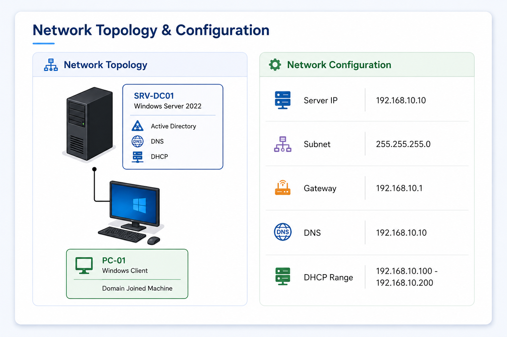
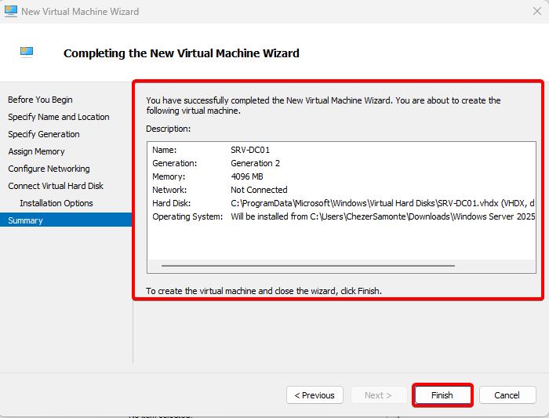
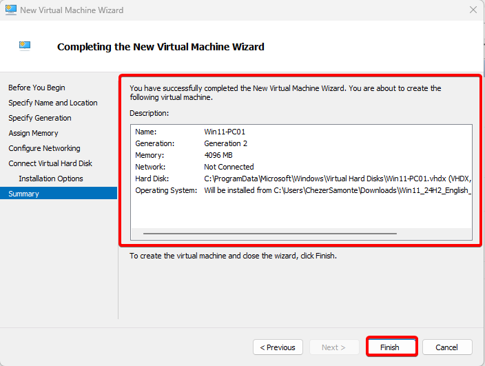

# Windows-Server-Home-Lab

## Description
This project demonstrates the setup of a Windows Server 2025 Home Lab
that simulates a small enterprise network environment.

It includes the installation and configuration of Active Directory,
DNS, and DHCP services, along with a Windows client joined to a domain.

The goal of this project is to develop hands-on skills in Windows Server
administration, network infrastructure setup, and basic enterprise IT operations.
 
## Objectives
- Install and configure Windows Server 2025
- Set up Active Directory Domain Services (AD DS)
- Configure DNS for domain name resolution
- Configure DHCP for automatic IP assignment
- Join a Windows client to the domain
- Practice basic troubleshooting in a network environment

## Technology Used
- Windows Server 2025
- Windows 10 / 11 Client
- Active Directory Domain Services
- DNS Server
- DHCP Server
- Hyper-V

## Network Topology & Configuration
- This section shows the network topology and IP configuration used in the Windows Server Home Lab environment.
  

- DHCP Range: 192.168.10.100 - 192.168.10.200

## Implementation Steps

1. Create Virtual Machines
   
Two virtual machines were created to simulate a basic enterprise environment: one server and one client machine.

- SRV-DC01 (Windows Server 2025) – used as the Domain Controller 

 

- PC-01 (Windows 10/11) – used as a domain-joined client machine 

 

2. Install Windows Server 2025
   
- Windows Server 2025 was installed on the SRV-DC01 virtual machine to prepare it as the main server for the environment.
- After installation, the server was renamed to SRV-DC01 for proper identification within the network.

