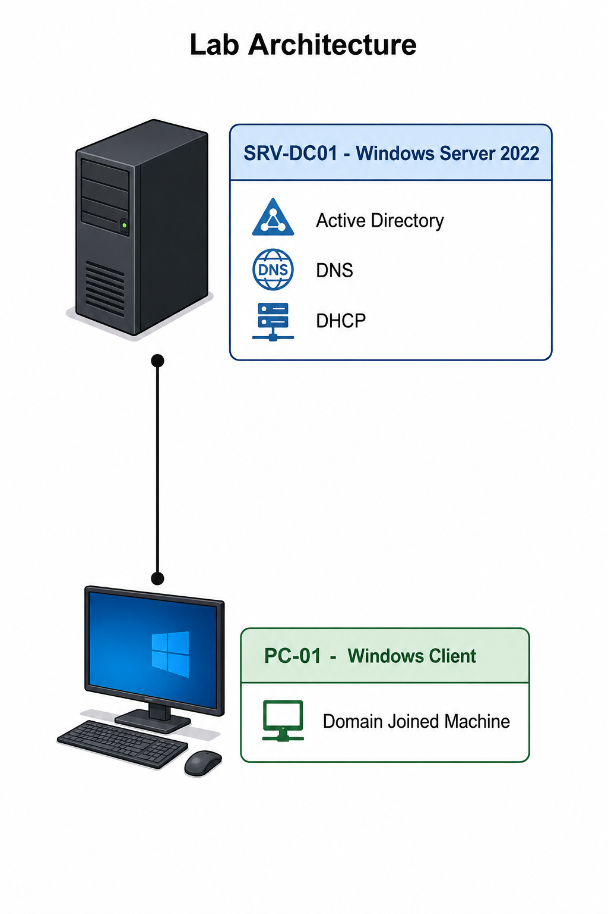

# Windows-Server-Home-Lab

## Description
This project demonstrates the setup of a Windows Server 2022 Home Lab
that simulates a small enterprise network environment.

It includes the installation and configuration of Active Directory,
DNS, and DHCP services, along with a Windows client joined to a domain.

The goal of this project is to develop hands-on skills in Windows Server
administration, network infrastructure setup, and basic enterprise IT operations.
 
## Objectives
- Install and configure Windows Server 2022
- Set up Active Directory Domain Services (AD DS)
- Configure DNS for domain name resolution
- Configure DHCP for automatic IP assignment
- Join a Windows client to the domain
- Practice basic troubleshooting in a network environment

## Technology Used
- Windows Server 2022
- Windows 10 / 11 Client
- Active Directory Domain Services
- DNS Server
- DHCP Server
- Hyper-V

## Network Topology

## Network Configuration
- Server IP: 192.168.10.10  
- Subnet: 255.255.255.0  
- Gateway: 192.168.10.1  
- DNS: 192.168.10.10 

- DHCP Range: 192.168.10.100 - 192.168.10.200
